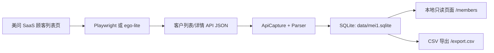

# 美问客户采集工具

本项目用于从美问 SaaS 顾客列表页采集客户列表、客户详情抽屉和账户/服务/记录等可见 tab 数据，落地到本地 SQLite，并提供一个本地只读客户浏览页面。

默认数据范围是客户列表和客户详情中已授权可见的数据。微信聊天内容不采集，附件文件不下载，手机号不以明文作为默认存储字段。

## 项目架构

```text
mei1/
├── src/mei1_crawler/
│   ├── cli.py          # 命令行入口，负责采集、增量同步、统计和本地页面服务
│   ├── browser.py      # Playwright 浏览器启动、登录等待和弹窗等待
│   ├── ego.py          # ego-lite 已登录页面采集适配
│   ├── capture.py      # API 响应处理、去重、增量变更识别
│   ├── parser.py       # 客户、资产、卡项、服务记录等字段规范化
│   ├── db.py           # SQLite 初始化、迁移、写入和统计查询
│   ├── viewer.py       # 本地只读客户浏览页面和 CSV 导出
│   └── hashutil.py     # 稳定内容哈希
├── sql/schema.sql      # 数据库表结构
├── docs/data-model.md  # 数据模型和采集边界说明
├── scripts/            # 本机全量、增量和循环采集脚本
├── data/               # 本地运行数据，已加入 .gitignore
└── pyproject.toml      # Python 包和命令行入口配置
```

数据流：



核心存储表：

- `source_payloads`：原始 API 请求和响应，作为回放与审计层。
- `members`：当前客户主档。
- `member_list_observations`：每次采集看到的列表行快照。
- `member_sync_states`：增量同步基线，保存客户列表稳定哈希。
- `member_change_events`：增量扫描发现的新客户或变更客户。
- `member_asset_snapshots`：客户钱包、积分、消费、到店等资产类快照。
- `member_account_items`：会员账户中的卡、券、赠送、商城优惠券、已转赠、寄存品项等。
- `member_service_records`、`member_detail_records`：服务记录和顾客数据明细二级 tab。
- `member_survey_profiles`、`member_attachments`、`member_partner_infos`：问卷、附件元数据、合伙人信息；空态不插入记录。

## 页面地址

| 类型 | 地址 |
| --- | --- |
| 美问来源页面 | `https://saas.mei1.com/app/#/member-new/list?index=0&page=1` |
| 本地客户列表 | `http://127.0.0.1:8787/members` |
| 本地客户详情 | `http://127.0.0.1:8787/members/{本地客户ID}` |
| CSV 导出 | `http://127.0.0.1:8787/export.csv` |
| 健康检查 | `http://127.0.0.1:8787/healthz` |

本地页面只读取 `data/mei1.sqlite`，支持分页、按姓名/会员号/手机号掩码/门店/等级/日期范围筛选、打开客户详情和导出当前筛选结果的基础客户字段。

## 部署要求

Miniconda 不是强制要求。只要运行环境满足以下条件即可：

- Python `>= 3.12`
- 可写的本地数据目录 `data/`
- SQLite，通常 Python 标准库已内置 `sqlite3`
- Playwright Chromium，只有使用 `crawl` 浏览器采集模式时需要
- `ego-browser` 命令，只有使用 `crawl-ego`、`crawl-ego-batch`、`crawl-ego-incremental` 模式时需要

推荐使用项目内虚拟环境：

```bash
cd /Users/leo/project/mei1
python3.12 -m venv .venv
. .venv/bin/activate
python -m pip install -U pip
python -m pip install -e .
python -m playwright install chromium
mei1-crawler init-db
```

如果本机已经有合适的 Python 环境，也可以直接安装：

```bash
cd /Users/leo/project/mei1
python -m pip install -e .
python -m playwright install chromium
mei1-crawler init-db
```

如果选择 Conda，可以复用仓库里的环境文件：

```bash
cd /Users/leo/project/mei1
conda env create -f environment.yml
conda activate mei1-crawler
python -m pip install -e .
python -m playwright install chromium
mei1-crawler init-db
```

## 启动本地页面

```bash
cd /Users/leo/project/mei1
. .venv/bin/activate
mei1-crawler serve --host 127.0.0.1 --port 8787
```

启动后访问：

```text
http://127.0.0.1:8787/members
```

如需后台运行：

```bash
mkdir -p logs
nohup mei1-crawler serve --host 127.0.0.1 --port 8787 > logs/viewer.log 2>&1 &
```

验证服务：

```bash
curl http://127.0.0.1:8787/healthz
mei1-crawler counts
```

## 采集命令

最小验证采集：

```bash
mei1-crawler crawl --limit-pages 1 --detail-limit 1
```

该模式会打开一个有界面的 Playwright 浏览器，使用 `data/browser-profile` 保存本地浏览器状态。如果未登录，会等待人工登录并关闭页面弹窗。

连接已有 Chrome：

```bash
mei1-crawler crawl \
  --existing-chrome \
  --cdp-url http://127.0.0.1:9222 \
  --limit-pages 1 \
  --detail-limit 1
```

已有 Chrome 必须提前用 DevTools 端口启动，例如包含 `--remote-debugging-port=9222`。

使用已登录的 ego-lite 页面：

```bash
mei1-crawler crawl-ego --task-space 35 --pages 3 --detail-per-page 2
```

分窗口采集更多列表页：

```bash
mei1-crawler crawl-ego-batch \
  --task-space 35 \
  --start-page 1 \
  --end-page 126 \
  --window-pages 1 \
  --detail-per-page 20 \
  --timeout 900
```

重建增量同步基线：

```bash
mei1-crawler rebuild-sync-state
```

执行一次抽样增量扫描：

```bash
mei1-crawler crawl-ego-incremental \
  --task-space 35 \
  --start-page 1 \
  --pages 3 \
  --window-pages 3 \
  --detail-batch-size 10
```

增量扫描会先读取列表行，比较 `member_sync_states` 中的稳定哈希，只对新客户或列表字段变化的客户拉取详情。

## 定时任务

推荐流程：

1. 首次执行全量或分批全量采集。
2. 执行 `mei1-crawler rebuild-sync-state` 建立增量基线。
3. 后续每 10 分钟执行一次 `crawl-ego-incremental`。

仓库提供了本机脚本：

```bash
zsh scripts/mei1_full.sh
zsh scripts/mei1_incremental.sh
zsh scripts/mei1_full_then_incremental_loop.sh
```

## Win10 运行

Win10 下推荐使用 PowerShell + Miniconda + Windows 任务计划程序。Python/SQLite 入库逻辑与 macOS 相同，差异只在环境激活、脚本和定时任务。

首次准备：

```powershell
cd C:\path\to\mei1
conda env create -f environment.yml
conda activate mei1-crawler
python -m pip install -e .
python -m playwright install chromium
mei1-crawler init-db
```

如果没有把 `conda.exe` 加入 PATH，脚本会尝试查找常见 Miniconda/Anaconda 安装目录；也可以手动设置：

```powershell
$env:CONDA_EXE = "C:\Users\<你的用户名>\miniconda3\Scripts\conda.exe"
```

已在 ego-lite 中人工登录并确认任务空间后，执行首次全量：

```powershell
powershell -ExecutionPolicy Bypass -File .\scripts\windows\mei1_full.ps1 `
  -ProjectDir "C:\path\to\mei1" `
  -TaskSpace 35
```

执行一次增量扫描：

```powershell
powershell -ExecutionPolicy Bypass -File .\scripts\windows\mei1_incremental.ps1 `
  -ProjectDir "C:\path\to\mei1" `
  -TaskSpace 35
```

安装每 10 分钟执行一次的 Windows 任务计划：

```powershell
powershell -ExecutionPolicy Bypass -File .\scripts\windows\install_incremental_task.ps1 `
  -ProjectDir "C:\path\to\mei1" `
  -TaskSpace 35 `
  -EveryMinutes 10
```

卸载任务计划：

```powershell
powershell -ExecutionPolicy Bypass -File .\scripts\windows\uninstall_incremental_task.ps1
```

Win10 运行注意事项：

- `crawl-ego-*` 仍依赖 `ego-browser` 命令和已登录的 ego-lite 任务空间。
- 任务计划使用当前用户的交互式登录会话，适合需要桌面浏览器态的 ego-lite；用户未登录 Windows 时不建议运行。
- 增量日志默认写入 `logs/incremental.log`。
- 若 PowerShell 执行策略阻止脚本，可使用上面的 `-ExecutionPolicy Bypass` 单次运行，不需要修改系统全局策略。

这些脚本当前是本机 Conda 封装，默认会激活名为 `mei1-crawler` 的 Conda 环境。如果部署环境使用 `.venv` 或系统 Python，建议直接使用下面的 cron 或循环写法，或按相同参数调整脚本里的环境激活部分。

cron 示例，每 10 分钟执行一次增量扫描：

```cron
SHELL=/bin/zsh
MEI1_PROJECT_DIR=/Users/leo/project/mei1
MEI1_EGO_TASK_SPACE=35

*/10 * * * * cd /Users/leo/project/mei1 && mkdir -p logs && . .venv/bin/activate && mei1-crawler crawl-ego-incremental --task-space "$MEI1_EGO_TASK_SPACE" --start-page 1 --pages 3 --window-pages 3 --detail-batch-size 10 >> logs/incremental.log 2>&1
```

`.venv` 常驻循环示例：

```bash
cd /Users/leo/project/mei1
. .venv/bin/activate

mei1-crawler crawl-ego-batch \
  --task-space 35 \
  --start-page 1 \
  --end-page 126 \
  --window-pages 1 \
  --detail-per-page 20 \
  --timeout 900
mei1-crawler rebuild-sync-state

while true; do
  sleep "${MEI1_INCREMENTAL_INTERVAL_SECONDS:-600}"
  mei1-crawler crawl-ego-incremental \
    --task-space 35 \
    --start-page 1 \
    --pages 3 \
    --window-pages 3 \
    --detail-batch-size 10
done
```

常用环境变量：

| 变量 | 默认值 | 用途 |
| --- | --- | --- |
| `MEI1_PROJECT_DIR` | `/Users/leo/project/mei1` | 项目目录 |
| `MEI1_EGO_TASK_SPACE` | `35` | 已登录 ego-lite 任务空间 |
| `MEI1_FULL_START_PAGE` | `1` | 全量采集起始页 |
| `MEI1_FULL_END_PAGE` | `126` | 全量采集结束页 |
| `MEI1_FULL_WINDOW_PAGES` | `1` | 全量采集每个窗口的页数 |
| `MEI1_FULL_DETAIL_PER_PAGE` | `20` | 全量采集每页拉取详情数量；等于默认列表页大小时会抓该页全部详情 |
| `MEI1_INCREMENTAL_START_PAGE` | `1` | 增量扫描起始页 |
| `MEI1_INCREMENTAL_PAGES` | `3` | 增量扫描页数 |
| `MEI1_INCREMENTAL_WINDOW_PAGES` | `3` | 增量扫描每个窗口的页数 |
| `MEI1_DETAIL_BATCH_SIZE` | `10` | 增量详情拉取批大小 |
| `MEI1_INCREMENTAL_INTERVAL_SECONDS` | `600` | 常驻循环间隔秒数 |
| `MEI1_EGO_TIMEOUT` | `900` | ego-lite 单窗口超时时间；增量脚本仍可用较小值 |

## 数据目录和安全边界

- 默认数据库：`data/mei1.sqlite`
- 默认 Playwright 浏览器状态：`data/browser-profile`
- 这些本地数据已经加入 `.gitignore`，不应提交到远程仓库。
- 不默认存储完整手机号明文。
- 不采集微信聊天内容。
- 不自动下载客户附件文件，只保留元数据字段。
- 无权限或未授权接口会跳过，并写入运行事件，不把失败响应当作有效客户数据。

## 常用检查

查看数据库统计：

```bash
mei1-crawler counts
```

指定数据库路径：

```bash
mei1-crawler --db /path/to/mei1.sqlite counts
mei1-crawler --db /path/to/mei1.sqlite serve --port 8787
```

查看命令帮助：

```bash
mei1-crawler --help
mei1-crawler crawl-ego-incremental --help
```

## 排障

- 本地页面提示数据库不存在：先执行 `mei1-crawler init-db`，或确认 `--db` 路径正确。
- Playwright 模式无法登录：使用有界面模式，不要在需要人工登录时加 `--headless`。
- 连接已有 Chrome 失败：确认 Chrome 使用了 `--remote-debugging-port=9222`，并且已有标签页地址包含 `saas.mei1.com/app/#/member-new/list`。
- ego-lite 模式失败：确认任务空间已经登录美问，并能打开顾客列表页。
- 增量扫描没有详情目标：表示抽样列表页没有发现新客户或稳定哈希变化，可扩大 `--pages` 或调整起始页。
